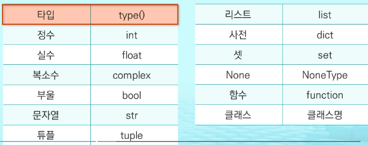
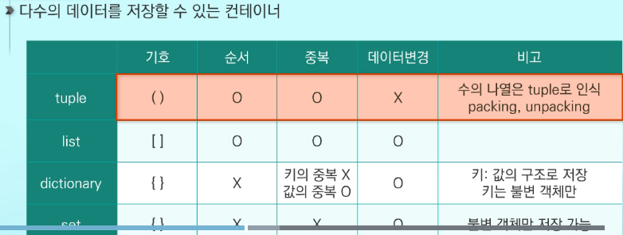
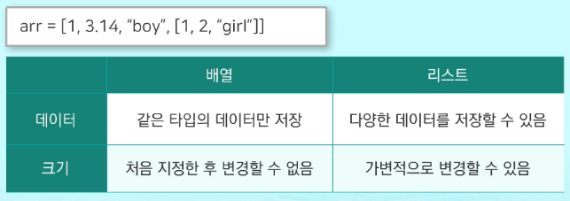
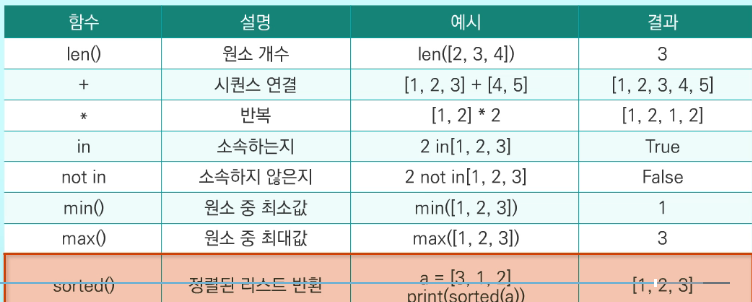
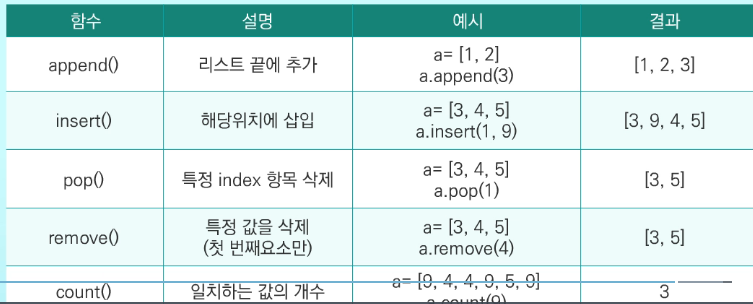
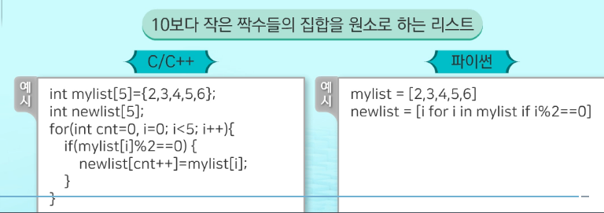

# Python

1. 인터프리터 언어

   > ==미리 기계어로 컴파일X, 실행시마다 소스를 기계어로 번역,실행==
   >
   > 느리지만 플랫폼에 상관없이 실행 가능

2. 객체지향 언어, 함수형 언어

-----------------

과거에는 프로그램의 `실행 속도`에 관심 -> 현재는 `개발 시간 단축`에 관심

## 변수

1. 모든 자료는 객체

   > Java, C에서의 기본형 타입 변수도 Python에서는 객체

2. 변수의 선언은 따로 X

   > 변수에 값 초기화 -> 변수가 메모리에 생성
   >
   > 하나의 변수에 다른 타입의 값을 변수에 저장 가능 
   >
   > (`데이터가 저장된 메모리의 주소`를 변수에 저장)

   ```
   a = 3
   a = "hello"
   ```

## 자료형





- packing = `,(콤마)`로 데이터 나열, 

  unpacking된 걸 하나씩 꺼내는 것 

- ==list보다 tuple이 처리 속도 빠르다.== 값 변경할 필요 없을 시 tuple 사용
- 중복X => dictionary의 key, set => 내부적으로 해싱 기법 => **값이 변경되지 않는 불변 객체만 사용 가능**

### List (배열)

> 같은 타입 변수들을 하나의 이름으로 열거, 사용
>
> **하나의 변수**를 통해서 대량의 데이터를 효율적으로 처리 가능

#### 사용법

- 값을 초기화하기 전에 변수를 미리 만들어둬야 하는 경우

  1. 공백 리스트 생성 `num = []`
  2. list 생성자로 리스트 생성 `arr = list()`

- 배열 vs 리스트

  

#### 시퀀스 자료형

- 순서 O -> `인덱싱`, `슬라이싱` 적용 가능

- 시퀀스 자료형에 쓰이는 함수 적용 가능

  

  - sorted vs sort

    sorted : `정렬된 새로운 리스트 반환`

    sort : `원본 리스트가 정렬`

#### 함수



#### 함축



