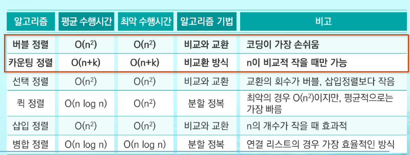
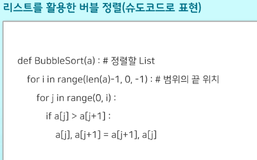
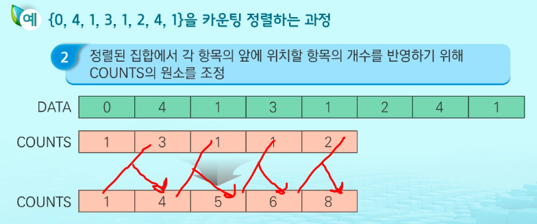
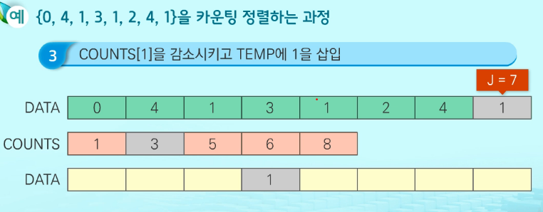
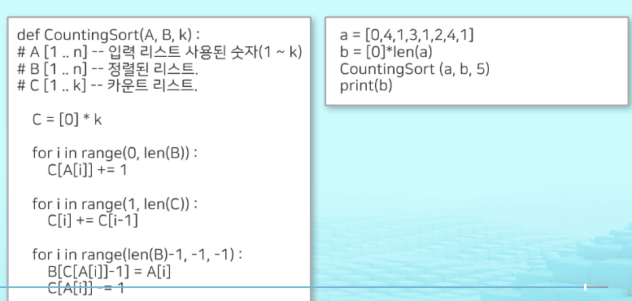
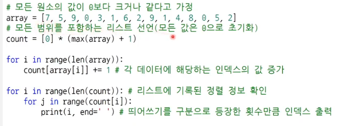

 

# 정렬

> 2개 이상의 자료를 특정 기준에 의해 오름차순 or 내림차순으로 재배열

## 정렬 방식

- 버블 정렬
- 카운팅 정렬
- 선택 정렬
- 퀵 정렬
- 삽입 정렬
- 병합 정렬
- 

## 버블 정렬

> 인접한 2개의 원소를 비교, 자리를 계속 교환
>
> 첫번째 원소부터 인접한 원소끼리 비교 -> 맨 마짐작 자리까지 이동
>
> 시간 복잡도  = `O(n^2)`

- 안쪽 반복문의 범위가 바깥쪽 반복문의 범위에 의해 제어

## 카운팅 정렬

> 각 항목이 몇개씩 있는지 세서 순서 결정
>
> 정수 or 정수로 표현 가능한 자료만 적용 가능
>
> `최대 정수값 알아야 함`
>
> 시간 복잡도 = `O(n+k)` n = 리스트 갯수, k = 정수 최대값
>
> ==데이터 max-min 차이가 크면 비효율적, 같은 값이 여러개일때 효율적==

==다른 방법==

- COUNTS 리스트에서 인덱스에 해당하는 값만큼 인덱스 출력

  ex) COUNTS = [1, 3, 1, 1, 2]

  DATA = [0, 1, 1, 1, 2, 3, 4, 4]

  

